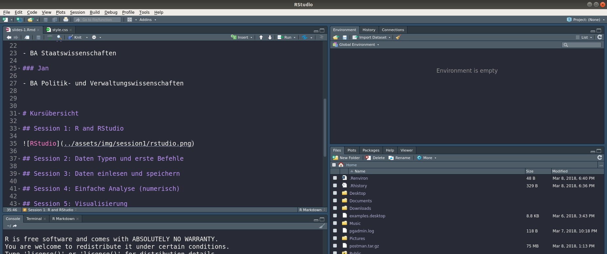

```{r setup, include=FALSE, echo=F, error=F, warning=F, message=F}
knitr::opts_chunk$set(echo = TRUE)

# load required packages
library(stringr)
library(readxl)
library(ggplot2)
library(ggmap)
library(tm)
library(wordcloud)
library(RColorBrewer)
library(tidytext)
library(dplyr)
```

## Vorstellung {.columns-2}

### Philipp

- BA Staatswissenschaften

### Jan

- BA Politik- und Verwaltungswissenschaften


# Syllabus

## Session 1: R and RStudio

```{r, out.width = "100%",echo=FALSE}

```

## Session 2: Daten Typen und erste Befehle

```{r}
text <- "Hello World!"
typeof(text)
```

```{r}
str_to_upper(text)
```

```{r}
ifelse(5 > 2, "Richtig", "Falsch")
```


## Session 3: Daten einlesen und speichern

```{r}
test_daten <- read_excel("../Data/gtdb_test.xlsx")
```

```{r}
table(test_daten$natlty1_txt[1:20])
```

```{r, eval=FALSE}
save(test_daten, file = "test_daten.R")
```

## Session 4: Einfache Analyse (numerisch)

```{r, echo=F, out.height='100%', fig.align='center'}
attacks <- table(test_daten$attacktype1_txt)
par_mar <- par()$mar
par(mar=c(10,3,5,1))
names(attacks)[5] <- "Kidnapping" 
names(attacks)[4] <- "Facility Attack" 
names(attacks)[3] <- "Bombing" 
barplot(attacks, main="Attacks by Type", las=2)
par(mar=par_mar)
```


## Session 5: Visualisierung

```{r, echo=F, out.height='100%', fig.align='center'}
plot_daten <- read_excel("../Data/gtdb.xlsx")
plot(latitude ~ longitude,
     xlab = "Longitude",
     ylab = "Latitude",
     main = "Attack ",
     las = 2,
     pch = 20,
     data = plot_daten)
```

## Session 6: Application Programming Interfaces

```{r, echo=F, error=F, warning=F, message=F, out.height='100%', fig.align='center'}
map <- get_map(location = c(15.25512, 54.52596), 
               zoom = 3, 
               maptype = "toner-background", 
               source = "stamen")
ggmap(map) +
  theme(axis.title = element_blank(),
        axis.ticks = element_blank(),
        axis.text = element_blank(),
        axis.line = element_blank()) +
  geom_point(aes(x = longitude, y = latitude),
             col = '#7f0000',
             data = plot_daten)
```

## Session 7: Introduction to Text Mining

```{r, echo=F, error=F, warning=F, message=F, out.height='100%', fig.align='center'}
text <- paste(plot_daten$summary, collapse = " ")
text <- str_replace_all(text, "\\d", " ")
df <- data.frame(text = text, stringsAsFactors = F) %>% 
  unnest_tokens(word, text) %>% 
  anti_join(stop_words, by = "word") %>% 
  count(word, sort = TRUE) 

colors = brewer.pal(8, "Dark2")
wordcloud(df$word[1:50], df$n[1:50],
          scale=c(8,.2),
          max.words=50, 
          random.order=FALSE, 
          rot.per=.15, 
          colors=colors)

```

## Session 8: Web Scraping

```{r, out.width = "100%",echo=FALSE}

```

# Agenda

## Agenda {.smaller}
1. Installation von R
2. Installation von RStudio
3. Einrichtung Betriebssystem

    `Pause (5 min)`

4. Was ist R?
5. Was ist RStudio?

    `Pause (5 min)`
    
7. R Projekte
8. Hilfe

## 1. Installation von R 3.4.3 (Kite-Eating Tree)

- Windows: [https://cran.r-project.org/bin/windows/base/](https://cran.r-project.org/bin/windows/base/)
- Mac: [https://cran.r-project.org/bin/macosx/](https://cran.r-project.org/bin/macosx/)

## 2. Installation von RStudio

## 3. Einrichtung Betriebssystem

- Texteditor installieren (Notepad++/Sublime)
- Umgebungsvariable einrichten
- Dateiendungen anzeigen
- Archiv (ZIP) Dateien (im Notfall 7Zip)

# 4. Was ist R?

## Über R

- R ist eine freie Programmiersprache für statistische Berechnungen und Grafiken (Wikipedia)
- Besondere Datenstrukturen und Funktionen für Statistik $\rightarrow$ Vorteil und Nachteil zugleich
- Unglaublich erweiterbar und flexibel durch sogenannte R-Pakete
    $\rightarrow$ "klassische" Datenanalyse, Text Mining, Webseiten, Presentationen erstellen, Grafiken erstellen, Reports schreiben, Daten runterladen

## Ein kleines Beispiel

```{r, eval=F}
# Dies ist ein Kommentar. Diesen muss ich nicht abschreiben.
# Er dient nur dazu, meinen Code zu erklären.
text <- "Hello World"
x <- 1:50
y <- rnorm(50)
plot(x = x, y = y)
```

# 5. Was ist RStudio?

## Über RStudio

- Integrated Development Environment
- funktioniert nur mit R
- macht uns die "Welt" sehr viel einfacher

## RStudio Tour

- Options
- Global Environment
- Plots
- Terminal vs Script

## 7. R Projekte

- data/
- plots/
- session1.R
- session2.R
    ...

## 8. Hilfe

- Stack Overflow
- Google
- Help
- ?function
- (Twitter)


