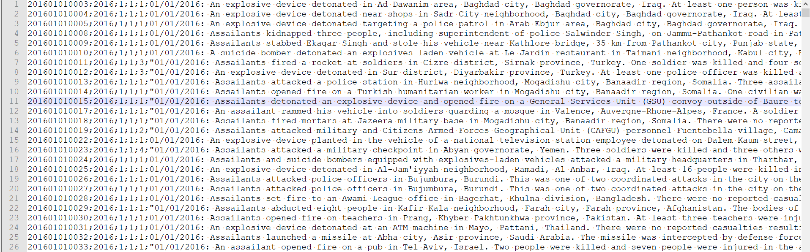
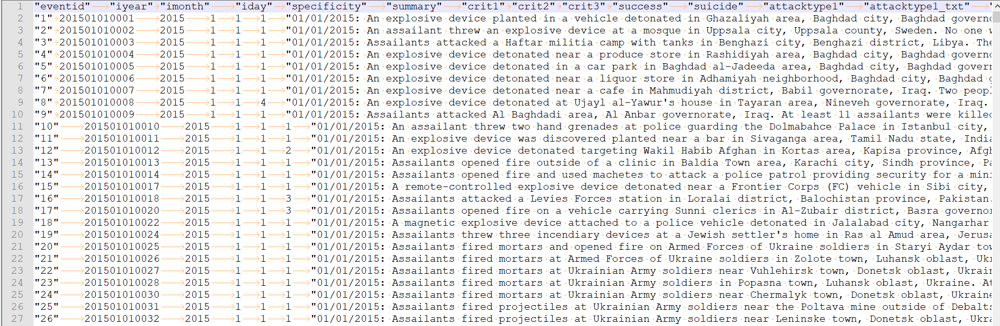
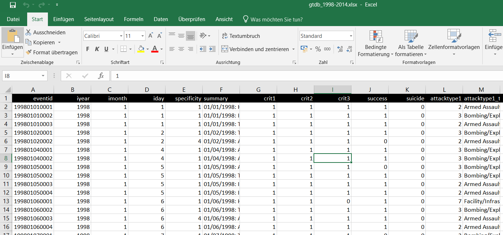

```{r setup, include=FALSE, echo=F, error=F, warning=F, message=F}
knitr::opts_chunk$set(echo = TRUE)

# load required packages
library(stringr)
library(readxl)

```

## Syllabus

Session 1 - R and RStudio

Session 2 - Data Typen und erste Befehle

`Session 3 - Daten einlesen und speichern`

Session 4 - Einfache Analyse (numerisch)

Session 5 - Visualisierung

Session 6 - Application Programming Interfaces (APIs)

Session 7 - Introduction to Text Mining

Session 8 & 9 - Web Scraping


# Agenda

## Agenda {.smaller}
1. Datenformate einlesen
2. Primitive Datentypen

    `Pause (5 min)`

3. Komplexe Datentypen

    `Pause (5 min)`
    
4. Datensatz einlesen
5. Hausaufgaben

# 1. Datenformate einlesen

## Comma Seperated Values (CSV) (1)

```{r, out.width = "100%",echo=FALSE}

```

## Comma Seperated Values (CSV) (2)

- jede Zeile in der Datei entspricht einer Zeile im Datensatz
- Spalten werden mit Hilfe eines sogenannten Seperators/Delimiter getrennt (Komma, Semicolon)

## Comma Seperated Values (CSV) (3)

```{r, eval=F}
# csv getrennt durch Komma
my_komma_csv <- read_csv("komma_csv.csv")
```

```{r, eval=F}
# csv getrennt durch Semicolon
my_semicolon_csv <- read_csv("my_csv.csv", delim = ";")
```


## Tab Seperated Values (TSV) (1)

```{r, out.width = "100%",echo=FALSE}

```

## Tab Seperated Values (TSV) (2)

- jede Zeile in der Datei entspricht einer Zeile im Datensatz
- Spalten werden mit Hilfe eines sogenannten Seperators/Delimiter getrennt (Tabulator)

```{r, eval=F}
# tab als Delimiter 
my_tsv <- read_csv("komma_csv.csv", delim = "\t")
```


## Excel (xls & xlsx) (1)

```{r, out.width = "100%",echo=FALSE}

```


## Excel (xls & xlsx) (2)


```{r, eval=F}
# Laden des Pakets "readxl"
library(readxl)

# xlsx 
my_xlsx <- read_excel("my_xlsx.xlsx")
```


## RData

- Bereits letzte Sitzung kennengelernt 
- Laden ins Enviroment mit ...


```{r, eval=F}
my_RData <- load("../Data/Session_3/gtdb_coordinates.Rdata")

```

# PAUSE (5 min)

# Daten zusammenführen

## R(ow)-bind (1)

- Verknüpft zwei Dataframes entlang ihrer Zeilen

```{r, eval= T, echo = FALSE}

df1 <- data.frame( Stadt = c("Konstanz", "Stuttgart", "Essen"),
                   Land = c("Kolumbien", "Schweiz", "Estland"),
                   Fluss =c("Kongo", "Seine", "Elbe"))

```


```{r, eval= T,}

df1 

```

```{r, eval= T, echo = FALSE}
df2 <- data.frame( Stadt = c("München", "Hamburg"),
                   Land = c("Mali", "Haiti"),
                   Fluss =c("Moldau", "Havel"))

```


```{r, eval= T,}

df2 

```


## R(ow)-bind (2)

```{r, eval= T,}

df_rbind <- rbind(df1, df2)


df_rbind

```


## C(olum)-bind (1)
- Verknüpft zwei Dataframes entlang ihrer Spalten

```{r, eval= T, echo = FALSE}

df3 <- data.frame( Name =  c("Kevin", "Sabine", "Eduard", "Mike", "Heidi"),
                   Tier= c("Kuh", "Schaf", "Esel","Möwe", "Hund"),
                   Beruf= c("Koch","Schriftstellerin", "Erzieher", "Maurer", "Headhunter"))

```

```{r, eval= T,}

df3 

```


## C(olum)-bind (2)

```{r, eval= T,}

df_cbind <-  cbind(df_rbind,df3)

df_cbind

```

## Merging (1)
- Verknüpfung von zwei Datensätzen mittels einer oder mehrerer Variablen

```{r, eval= T, echo = FALSE}

df_purchase <- data.frame( Customer_ID =  c(1:4),
                   Product= c("Tablet", "Phone", "Laptop", "Clock"),
                   Price= c(249, 760, 1200,300))

```

```{r, eval= T,}

df_purchase 

```

```{r, eval= T, echo = FALSE}

df_income <- data.frame( Customer_ID =  c(2,3,1,4),
                   Income= c(3600,750,1200,1800))

```

```{r, eval= T,}

df_income 

```


## Merging (2)

```{r, eval= T,}
# merge two datasets 
transparent_customer <-  merge (df_purchase,df_income, by = "Customer_ID")


transparent_customer

```


# PAUSE (5 min)

## Daten Speichern

