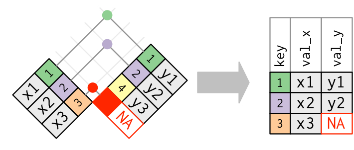

```{r setup, include=FALSE, echo=F, error=F, warning=F, message=F}
knitr::opts_chunk$set(echo = TRUE)
htmltools::tagList(rmarkdown::html_dependency_font_awesome())

# load required packages
library(stringr)
library(readxl)
library(readr)
```

## Syllabus

Session 1 - R and RStudio

Session 2 - Data Typen und erste Befehle

Session 3 - Daten einlesen und speichern

`Session 4 - Einfache Analyse (numerisch)`

Session 5 - Visualisierung

Session 6 - Application Programming Interfaces (APIs)

Session 7 - Introduction to Text Mining

Session 8 & 9 - Web Scraping

## Agenda
1. Hausaufgaben besprechen
2. Dokumentation
3. Subsetting
4. Aufgaben
5. Einfache Analysen
6. Aufgaben

# 1. Hausaufgaben besprechen

```{r, echo=FALSE, warning=FALSE, message=FALSE}
gtdb_1998_2014 <- readxl::read_excel("../Data/Session_3/gtdb_1998-2014.xlsx")
gtdb_2015 <- readr::read_tsv("../Data/Session_3/gtdb_2015.tsv")
gtdb_2016 <- readr::read_csv2("../Data/Session_3/gtdb_2016.csv")
load("../Data/Session_3/gtdb_coordinates.RData")
```

## Aufgaben

1. Inspiziere die unterschiedlichen Dateien des Ordners `./Data/Session_3`.
2. Lade alle Dateien in R und speicher sie in unterschiedlichen, aussagekräftigen Variablen.
3. Schaue dir die Variablen mit Hilfe des Befehls `View()` an.
4. Füge die vier Teildatensätze sinnvoll zusammen. Überlege sorgfältig, welche der kennengelernten  Funktionen du dabei benötigst und welche nicht. 
5. Speicher den finalen Datensatz im rds-Format in deinem Projektordner unter `/data/gtdb.RDS`.  

## Probleme mit Trennzeichen

- `read_csv` für Daten die mit Komma `,` getrennt sind.
- `read_csv2` für Daten die mit Semikolon `;` getrennt sind.
- `read_tsv` für Daten die mit Tab `\t` getrennt sind.
- Allgemein kann man `read_delim` benutzten und alle Parameter selber spezifizieren. Die vorherigen Funktionen sind Spezialfälle von `read_delim`.

## gtdb_1998-2014.xlsx

```{r, echo=TRUE, eval=FALSE}
gtdb_1998_2014 <- read_excel("./Data/Session_3/gtdb_1998-2014.xlsx")
head(gtdb_1998_2014)
```

```{r, echo=FALSE}
head(gtdb_1998_2014)
```


## gtdb_2015.tsv

```{r, echo=TRUE, eval=FALSE}
gtdb_2015 <- read_tsv("./Data/Session_3/gtdb_2015.tsv")
head(gtdb_2015)
```

```{r, echo=FALSE}
head(gtdb_2015)
```

## gtdb_2016.csv

```{r, echo=TRUE, eval=FALSE}
gtdb_2016 <- read_csv2("./Data/Session_3/gtdb_2016.csv")
head(gtdb_2016)
```

```{r, echo=FALSE}
head(gtdb_2016)
```

## gtdb_coordinates.RData

```{r, echo=TRUE, eval=FALSE}
load("./Data/Session_3/gtdb_coordinates.RData")
head(gtdb_coordinates)
```

```{r, echo=FALSE}
head(gtdb_coordinates)
```

## <i class="fa fa-exclamation-triangle "></i> Obacht: Spaltennamen (1)

- Zusätzlich muss man auf die Spaltennamen achten. Man kann eigene Spaltennamen mit dem Argument `col_names` angeben.

```{r}
# Spaltennamen auslesen aus gtdb_2015
headers <- names(gtdb_2015)
```

```{r, echo=FALSE, message=FALSE}
headers
gtdb_2016 <- read_csv2("../Data/Session_3/gtdb_2016.csv",
                       col_names = headers)
```

## <i class="fa fa-exclamation-triangle "></i> Obacht: Spaltennamen (2)

```{r, echo=TRUE, eval=FALSE}
# Datensatz einlesen und neue Spaltennamen übergeben
gtdb_2016 <- read_csv2("./Data/Session_3/gtdb_2016.csv",
                       col_names = headers)
```
```{r, echo=FALSE}
head(gtdb_2016, 5)
```

## Merge

```{r, out.width = "100%",echo=FALSE}

```

## Aufgabe 4:

```{r}
# Datensätze zusammenführen
gtdb <- rbind(gtdb_1998_2014,
              gtdb_2015,
              gtdb_2016)

# Koordinaten anfügen
gtdb <- merge(gtdb, gtdb_coordinates,
              by = "eventid")
```


## Aufgabe 5:

```{r,eval=FALSE}
# Finalen Datensatz unter './Data/' speichern
saveRDS("./Data/gtdb.RDS")
```

# 2. Dokumentation

# 3. Subsetting

## Subsetting (1)

```{r}
a <-  c(1, 2, 3, 4, 5, 6, 7, 8, 9, 10)
a[1:3]
```
```{r}
b <- c(1, 2, 3, 1, 3, 5, 7, 1, 3, 1)
b[b == 1]
```
```{r}
a[b >= 3]
```

## Subsetting (2)

```{r, echo=FALSE}
s_l_f <- data.frame( Stadt = c("Konstanz", "Stuttgart", "Essen"),
                   Land = c("Kolumbien", "Schweiz", "Estland"),
                   Fluss = c("Kongo", "Seine", "Elbe"),
                   Einwohner = c(82, 32, 56),
                   stringsAsFactors = FALSE)
```
```{r}
s_l_f
```

- mit eckigen Klammern können wir uns Werte an einer bestimmten Stelle ausgaben lassen

```{r}
# df[row, column]
s_l_f[1, 2]
```

## Subsetting (3)

- wenn wir den `row`-Parameter frei lassen, kriegen wir alle Reihen
```{r}
# df[ , column]
s_l_f[ , 2]
```

- wenn wir den `column`-Parameter frei lassen, kriegen wir alle Spalten
```{r}
# df[row, ]
s_l_f[1, ]
```

## Subsetting (4)

- <i class="fa fa-exclamation-triangle "></i> Bedingung immer nur auf der Reihe, **nie** auf der Spalte

```{r}
# df[Bedingung, ]
s_l_f[s_l_f$Einwohner > 50, ]
```

```{r}
# df[Bedingung, column]
s_l_f[s_l_f$Einwohner > 60, c("Land", "Fluss")]
```

## Subsetting (5)

```{r}
# df[mehrere Bedingung, ]
s_l_f[s_l_f$Einwohner == 82 | s_l_f$Land == "Schweiz", ]
```

```{r}
# df[mehrere Bedingung, ]
s_l_f[s_l_f$Einwohner == 82 & s_l_f$Land == "Schweiz", ]
```

# 4. Aufgaben

## Aufgaben:

Lade den Datensatz `gtdb`, den du in den Hausaufgaben erstellt hast.

1. Speicher alle Daten aus dem Jahr 2002 in einer neuen Variablen `gtdb_2002`.
2. Speicher alle Events, bei denen es mehr als 200 Tote gab in `gtdb_200`.
3. Speicher alle Summaries für Selbstmordanschläge in `summary_suicide`.
4. Speicher `Latitude`, `Longitude` und `attacktype_1_txt` für die Jahre `1999` und `2003` in `gtdb_geo`.
5. Speicher alle Daten für alle Jahre vor `2006` bei denen das Ziel das Militär war in `gtdb_military`.


# 5. Einfache Analysen

## <i class="fa fa-code "></i> Wichtige Befehle

### Allgemein
- `is.na`

### Kategorial

- `table`

### Numerisch

- `summary`
- `sum`, `mean`, `median`, `min`, `max`

# 6. Aufgaben

## Aufgaben (1)

1. Was ist der Median von `nkill`?
2. Wieviele Selbstmordanschläge gab es?
3. Wieviele verschiedene Kategorien hat die Variable `attacktype1_txt`?
4. Wieviele Selbstmordanschläge gab es im Jahr 2003?
5. Wie oft wurde das russische Militär angegriffen? 

## Aufgaben (2)

6. Wie oft war ein Selbstmordanschlag mit einer Bombe erfolgreich?
7. Bestimme alle Kennzahlen von `nkill` und interpretiere diese.
8. Wie hoch ist der `mean` bei Selbstmordanschläge? Wie hoch bei allen anderen Fällen?
9. Wieviel Anschläge gab es im Jahr 2009 bei dem das Ziel eine `Educational Institution` oder das angegriffene Ziel aus `East Timor` war?
10. Wie oft könnte die Opferzahl nicht ermittelt werden?


