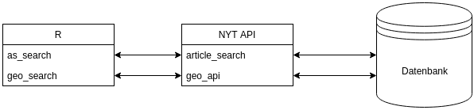

```{r setup, include=FALSE, echo=F, error=F, warning=F, message=F}
knitr::opts_chunk$set(echo = TRUE)

# load required packages
library(stringr)
library(readxl)
library(ggplot2)
library(ggmap)
library(tm)
library(wordcloud)
library(RColorBrewer)
library(tidytext)
library(dplyr)
```

## Syllabus

Session 1 - R and RStudio

Session 2 - Data Typen und erste Befehle

Session 3 - Daten einlesen und speichern

Session 4 - Einfache Analyse (numerisch)

Session 5 - Visualisierung

`Session 6 - Application Programming Interfaces (APIs)`

Session 7 - Introduction to Text Mining

Session 8 & 9 - Web Scraping


## Agenda

1. Was sind in APIs
2. Benötigte Pakete

# Was sind APIs?

## Was sind APIs (Webservices)? (1)

- Schnittstellen für einfache Datenabfragen
- Per URL ansprechbar

## Was sind APIs? (2)

```{r, out.width = "100%",echo=FALSE}

```


# Benötigte Pakete

## ggmap (1)

```{r, message=F, eval=F}
# Paket laden
library(ggmap)
# Koordinaten für Konstanz
geocode("Konstanz")
```

```{r, echo=F, message=F}
coord <- geocode("Konstanz")
coord
```


```{r, eval=F, message=F}
# 
revgeocode(location = as.numeric(coord[1,]),
           output = "more")
```

## ggmap (2)


## rtimes (1)

- Key beantragen: [https://developer.nytimes.com/signup](https://developer.nytimes.com/signup)
- Key speichern unter `.Renviron`

```{bash, eval=F}
NYTIMES_AS_KEY=***
```


## rtimes (2)

```{r, message=F, eval=F}
# Paket laden
library(rtimes)
#
as_search("")

```


## rtweet

```{r}
library(rtweet)
```


