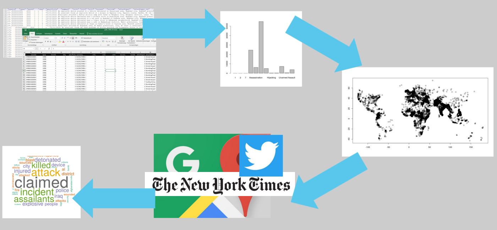
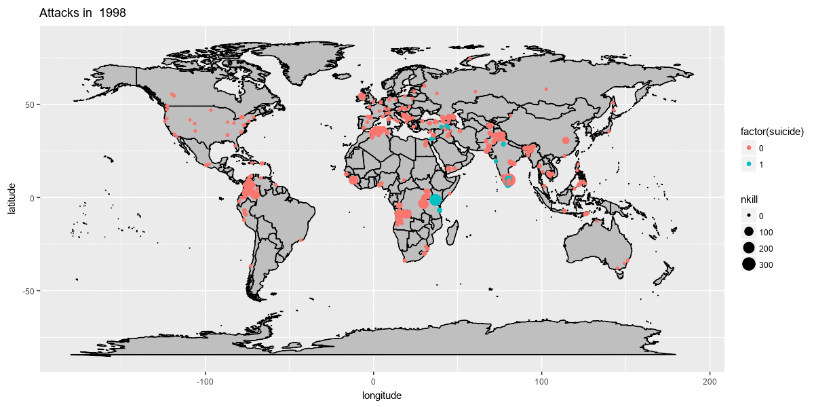

```{r setup, include=FALSE, echo=F, error=F, warning=F, message=F}
knitr::opts_chunk$set(echo = TRUE)

# load required packages
library(tidyverse)
library(httr)
library(rvest)
```

## Syllabus

Session 1 - R and RStudio

Session 2 - Data Typen und erste Befehle

Session 3 - Daten einlesen und speichern

Session 4 - Einfache Analyse (numerisch)

Session 5 - Visualisierung

Session 6 & 7 - Application Programming Interfaces (APIs)

`Session 8 & 9 - Introduction to Web Scraping`


## Agenda

1. Platzhalter - Tool Erklären 
2. Aufgaben
3. Recap - Was wir jetzt können?
4. Danke ! 


# Hausaufgaben besprechen


## Aufgaben

1. Lade den Datensatz `nyt_articles.rds`, in dem wir mittels der NYT API Metadaten zu Artikeln, die mit den Anschlägen in Verbindung steheen könnten, herunter geladen haben. 
2. Scrape nun (vielleicht hier nochmal ein Subset wcount > 2000 ?) mittels ... den vollen Text der Artikel 


# Recap 

## Road Map

```{r, out.width = "100%",echo=FALSE}

```


## Was Ihr könnt - Basics (1): 

- Basaler Umgang mit GIT 
- CSV/EXCEL/JSON ... einlesen 
- Daten speichern 
- Einfache Konzepte der Programmierung (Ifelse, Loop)
- Numerische Analyse mit R 
- Basic Plots mit R

## Was Ihr könnt  Fancy Zeug (2) ... 
- Interaktion mit unterschiedlichsten API's 
- Nie wieder Daten von Hand kopieren (HMTAB)
- Websiten scrapen 
- Die nötige Neugier auf mehr ? 


## Weiterführende Ideen - Was ist möglich (1) ? 

```{r, out.width = "100%",echo=FALSE}

```

## Weiterführende Ideen - Was ist möglich (2)? 

Hast du hier noch was fancys Jan ? 


## Weiterführende Links 

- Tutorial: [R For DataScience](http://r4ds.had.co.nz/index.html)
- Tutorial: [Text Mining with R](https://www.tidytextmining.com/index.html)


